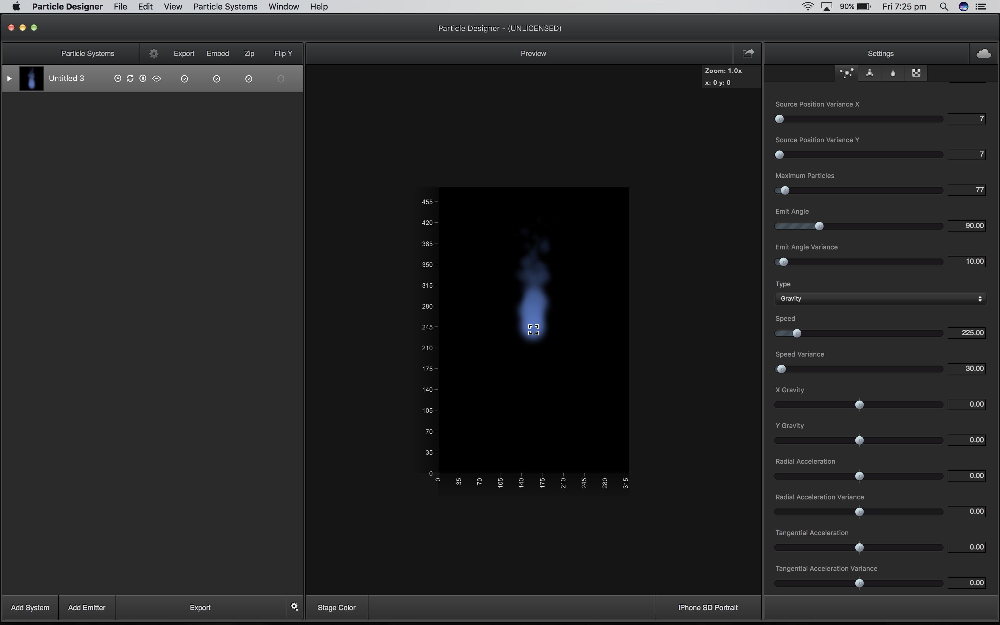
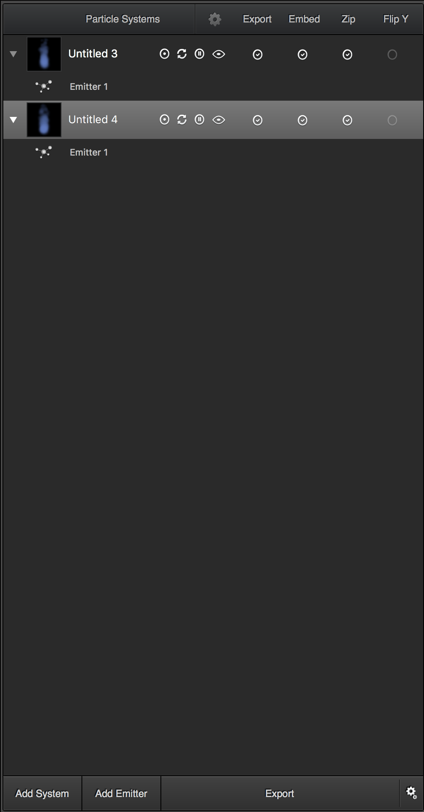
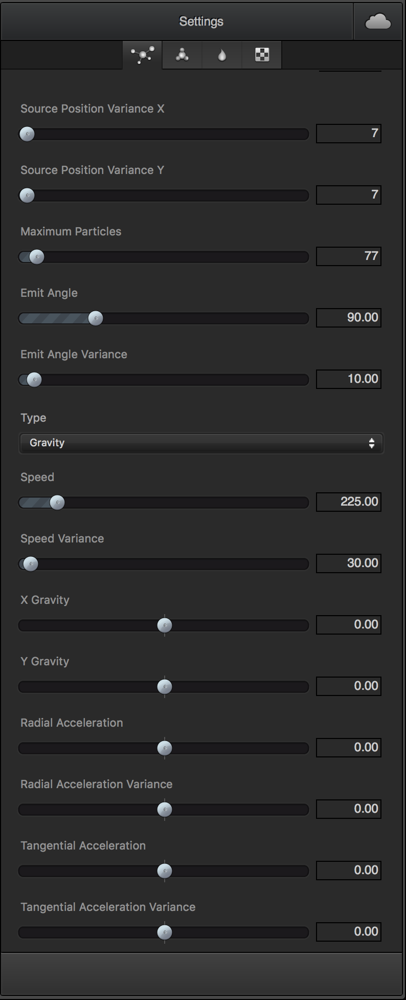
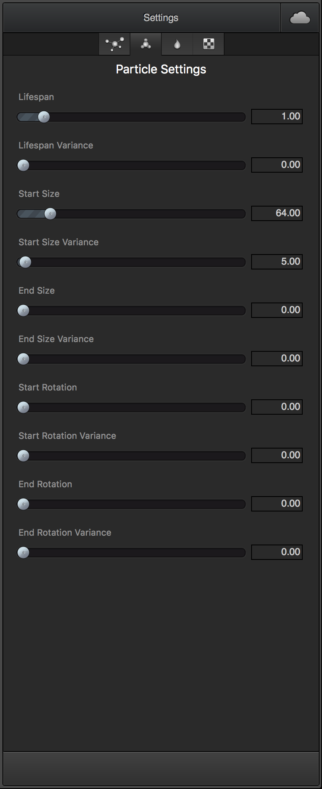
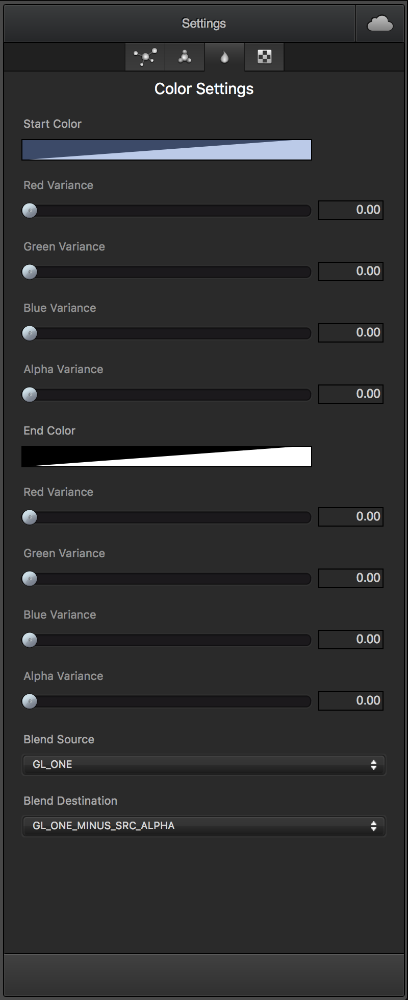
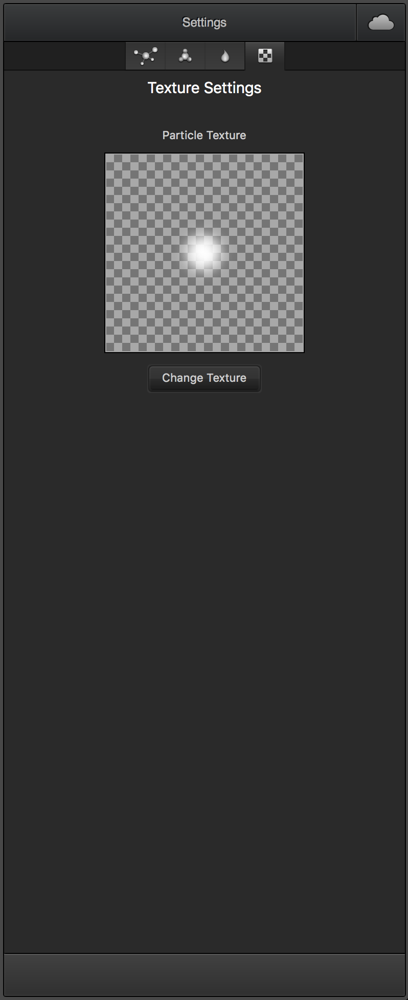
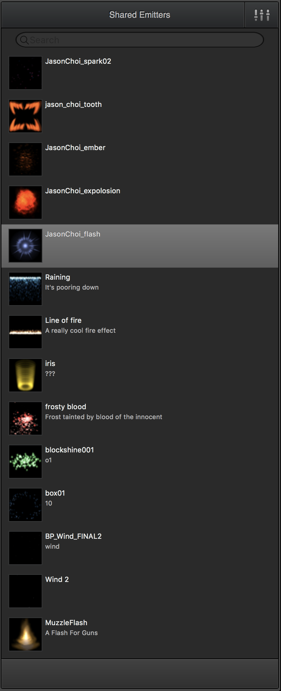
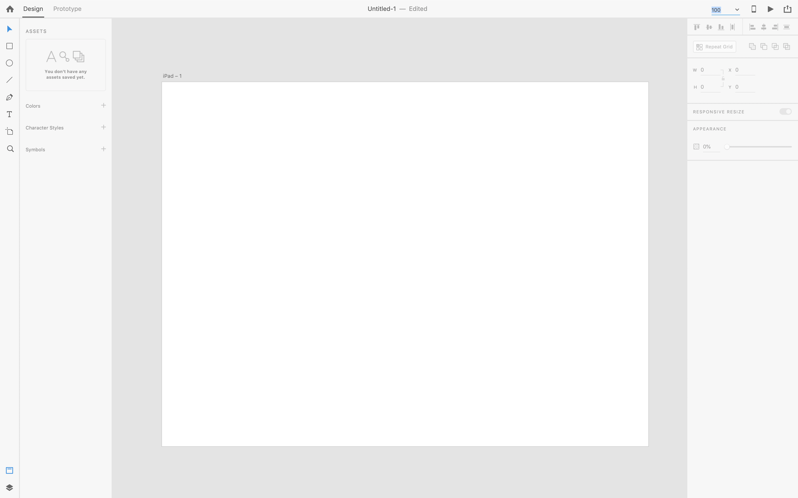

# Stage 0

Author(s): [rohan-deshpande](http://github.com/rohan-deshpande)

Last updated: 2018-11-17

Status: **COMPLETE**

## Abstract

This application will aim to deliver a fully featured 3D particle designer for Mac, Linux and Windows. This will be accomplished using web technologies such as

* [JavaScript](https://www.javascript.com/)
* [React](https://facebook.github.io/react/)
* [Three](https://threejs.org)
* [NWJS](https://nwjs.io) / [Electron](https://electronjs.org/)

The app will have a GUI for creating, editing and saving projects as well as the ability to export particle designs in different formats.

## Background

Currently, there is no way to easily design particles for `three` based apps. There are a number of particle engines that have been developed for the library such as

* [ShaderParticleEngine](https://github.com/squarefeet/ShaderParticleEngine)
* [three.proton](https://a-jie.github.io/three.proton/)

However, these engines have limitations when wanting to design advanced particle effects as all the work would need to be done in code, which is impractical.

This app will leverage, `three` and one of the libraries listed above for visualization, couple it to a GUI and enable designers to create particle designs without having to write code and with instant feedback.

## Proposal

Much like 71Squared's **[Particle Designer](https://71squared.com/particledesigner)** a desktop application will need to be created with a number of views and controls to support the ability design, save, edit and export particles.

The difference to Particle Designer is that particles will need to support emission in 3D space.

I propose that we leverage what this application is doing as much as we can, but add features to make the particles work in 3D space.

Conceptually, and at a basic level, this should be as simple as adding a third axis to the potential direction in which a particle can go. For example in the _Emitter Settings_ of the app, there are configurations for `Source Position Variance X` and `Source Position Variance Y`; we would simply add `Source Position Variance Z`.  

If we want to get really advanced, we would add some kind of path finding where we could force the particles to follow a line or a curve the user has drawn. This is pretty advanced though.

## Rationale

The main draw back here of course is that it's going to be a lot of work.

One alternate approach could be to build a `three` based particle effect importer. While this could be possible, there are some issues with this approach.

Mainly, this will couple your `three` app to another app. If that app is open source or well supported, then that might be fine, however any API changes in that app will cause the importer to also require an update.

The advantage of this method would be that the actual designing would already be taken care of.

I'm actively researching other potential particle designers right now to see if this might be possible. I'm not having much luck though.

## Implementation

As mentioned above there are a few open source libraries which we will have to use to make this in a reasonable amount of time while still delivering something stable. In terms of UX, we can take some inspiration from Particle Designer but also perhaps from modern products like Adobe XD

In terms of UI toolkits, we'll need something which can deliver things like well developed sliders and is fully featured enough to support expansion. I'm currently looking at [Blueprint](http://blueprintjs.com/) for this purpose as it's got a lot of components, including sliders. You can check out the docs [here](https://blueprintjs.com/docs/)

## Open issues

### Sequences

One issue is that Particle Designer doesn't seem to really have a "timeline" like feature which would be very useful for creating particle effect sequences. This of course would be a tonne of work, but I'm not sure how an effect would "start" and "end" without one.

### Collisions

There's also the question of collisions. This is something that is not relevant to 2D environments but is very real for 3D ones. Particles colliding with 3D meshes can create ugly clipping like effects and artefacts. I'm not sure if the designer should have some kind of control for this or if that should be the job of the tool importing the particle design data which the app exports.

### Electron vs NWJS

Not really much in it here if we want to open source the app (which I think is the best idea). I would vote for Electron simply because I'd like to learn it a little bit more as currently most of my experience with desktop JS has been with NWJS, but happy to go either way.

### License

What kind of license should we develop this under? Given the gap in the market for a tool like this, I think there is potential to monetize it, I think all contributors should agree on what the plan should be going forward.
